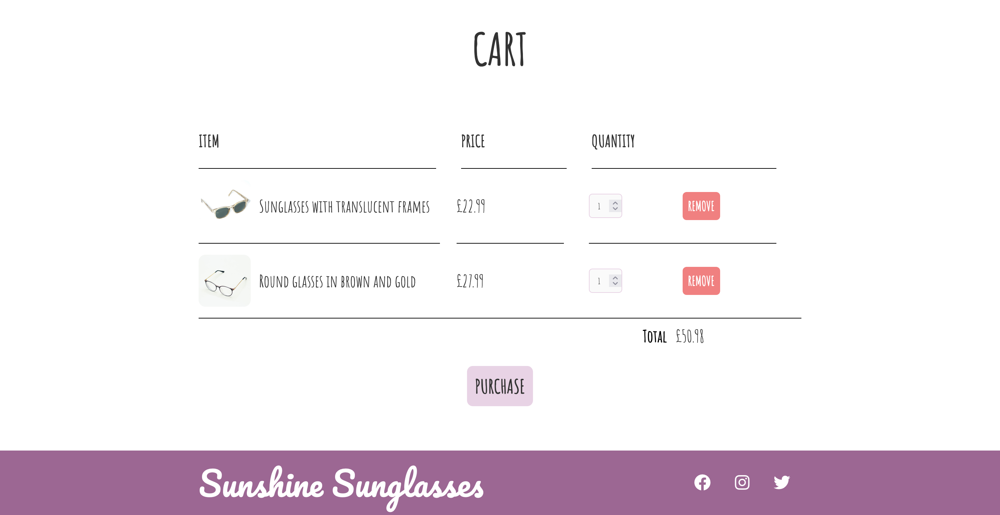

# E-Commerce Sunglasses Shop

This is an e-commerce website for a fictional company selling sunglasses

## Table of contents

- [Overview](#overview)
  - [The challenge](#the-challenge)
  - [Screenshot](#screenshot)
  - [Links](#links)
- [My process](#my-process)
  - [Built with](#built-with)
  - [What I learned](#what-i-learned)
  - [Continued development](#continued-development)
  - [Useful resources](#useful-resources)
- [Author](#author)
- [Acknowledgments](#acknowledgments)

## Overview

### The challenge

Design a functional shopping cart using HTML, CSS and vanilla JavaScript.

### Screenshot

### Links

- Live Site URL: (https://your-live-site-url.com)

## My process

### Built with

- Semantic HTML5 markup
- CSS
- JavaScript

### What I learned

### Continued development

I would like to develop this project further by building a more complex shopping cart in React.

### Useful resources

- W3Schools (https://www.w3schools.com/)

- Google Fonts (https://fonts.google.com/)

## Acknowledgments

Thanks to freeCodeCamp and Web Dev Simplified for inspiration on building the initial stages of the shopping cart.
